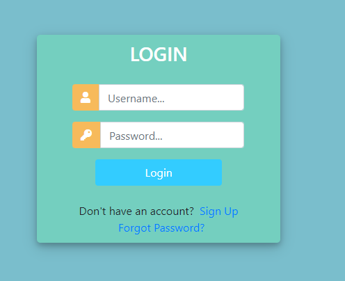

**EVENT EASE APP**

**Ticketing System and Booking System**

**Overview**

The Ticketing System is a Django-based web application that simplifies event management by offering features such as user registration,  event booking, and ticket categorization.     The platform is designed with a focus on providing a seamless user experience, security, and scalability.    
**Core Features**  
**User Registration and Authentication:**    

Secure user registration with email verification. 

Login, "Forgot Password," and "Sign Up" functionalities. 

Hashed passwords for enhanced security   
**Event Listings:**    
Browse available events with details such as date, time, location, and slots. 
Detailed event pages for additional information and registration.   

**Booking System:** 
User-friendly booking interface with ticket categorization (e.g., VIP, Regular, Early Bird). 

Automatic confirmation emails upon successful booking.   

**Admin Panel:**

Manage events, user registrations, and permissions.

Analytics for tracking registrations and popular events.  
**Additional Enhancements** 
**User Profiles:** 
Dashboard for viewing booking history and upcoming events. 

Profile updates, including pictures and contact details.   

**Accessibility:**  
WCAG-compliant design with screen reader support.

Keyboard navigation for enhanced accessibility.    
**Scalability:**  

Ready for deployment on cloud platforms like AWS and Heroku.

Caching mechanisms to optimize performance.   
**Installation**
**Prerequisites** 
Python 3.8+

Django 3.2+

PostgreSQL (or SQLite for development)

Node.js and npm (for optional frontend enhancements)   
**Setup**
**Clone the repository:**
git clone https://github.com/yourusername/ticketing-system.git
cd ticketing-system
  
Create a virtual environment and install dependencies:
 
python3 -m venv env
source env/bin/activate
pip install -r requirements.txt

**Configure the database in settings.py:**
  
DATABASES = {
    'default': {
        'ENGINE': 'django.db.backends.postgresql',
        'NAME': 'your_database_name',
        'USER': 'your_database_user',
        'PASSWORD': 'your_password',
        'HOST': 'localhost',
        'PORT': '5432',
    }
}

**Apply migrations:**

python manage.py migrate

**run the development server**

python manage.py runserver

**Access the application at http://127.0.0.1:8000.**

**Usage**

**Admin Panel** (For users with Priviledges)  
Access the admin panel at http://127.0.0.1:8000/admin.
 
Use the admin interface to create, update, and delete events

**User Features**
Register or log in to view events and make bookings.

Manage bookings and profiles through the dashboard.

**API Endpoints**

**User Authentication**

POST /api/register: Register a new user.

POST /api/login: Authenticate a user.

**Events**

GET /api/events: Retrieve a list of available events.

POST /api/book: Book tickets for an event.

**Pending Features**

Payment Integration: Secure payment gateway support (e.g., Stripe, PayPal).

QR Code Scanning: Automated QR code generation for event check-ins.

Enhanced Notifications: SMS or push notifications for reminders.

**Lessons Learned**

The importance of responsive design for a seamless user experience.

Balancing feature richness with development timelines.

Leveraging Django’s built-in tools for rapid development.

**Next Steps**

Finalize payment integration.

Implement advanced analytics for event tracking.

Deploy the application on Heroku or AWS.

**License**

This project is licensed under the MIT License. See the LICENSE file for details.

**Contributing**

Contributions are welcome! Please fork the repository and submit a pull request for review.